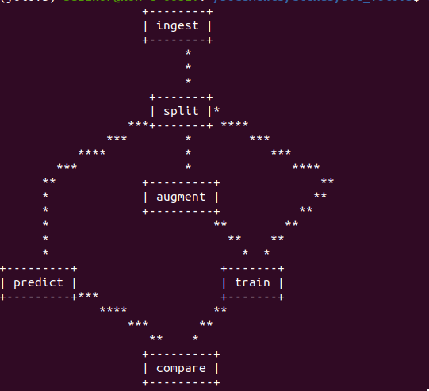
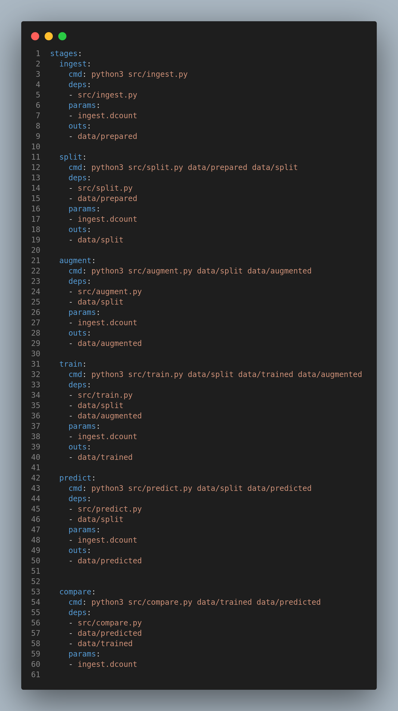
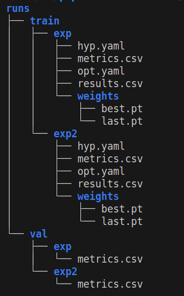

# Pedestrian Detection MLOps Pipeline (Local)

## DVC pipeline for Pedestrian Detection using YoloV5 with Data Versioning



<br/>

<!-- > ## Checkout to `clouds3` branch for pushing results/outputs to AWS S3 Bucket
<br/> -->

# Getting Started
## 1. Create a Python environment
```shell
python3 -m venv <env_name>
source <env_name>/bin/activate
```

## 2. To initialize DVC and GIT
```shell
pip3 install dvc
git init
dvc init
```

## 3. Installing dependencies
To install requirements for running object detection pipeline with YoloV5
Requires PyTorch, CUDA(if GPU Enabled)
```shell
pip3 install -r requirements.txt
````

## 4. Setting paramenters
Here dcount is the number of versions of datasets uploaded(dcount = 0 when initialised)
```
# file params.yaml
ingest:
    dcount:0
```

## 5. To run DVC pipeline
```shell
dvc repro
```

<!-- ## 6. To run Streamlit App
```shell
streamlit run main.py
``` -->

## 6. Adding pipeline stage

```shell
dvc run -n <Stage_name> 
    -p ingest.dcount -p <add parameters> 
    -d src/<Stage_file>.py -d <Any dependencies>
    -o data/<Output dir> 
    python3 src/prepare.py
```

## 7. Pipeline DAG
```shell
dvc dag
```

<!-- ## 9. Push results/outputs to AWS S3
Create .streamlit/secrets.toml file and add your AWS S3 BUCKET ACCESS_KEY and SECRET_KEY

```
ACCESS_KEY = 'xxxxxxx'
SECRET_KEY = 'xxxxxxxxxxxxxx'
``` -->


## Folder Structer for DVC Pipeline - src/
<br>

<br>
<br>

# dvc.yaml -  pipeline format
<br>



<br>
<br>

# Folder structure for metrics - train / val
<li> a* metrics.csv * stores label, Precision, Recall, F1-score, mAP50 and mAP50-95.
<br>
<br>

